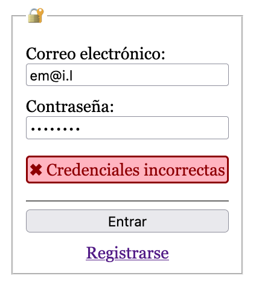
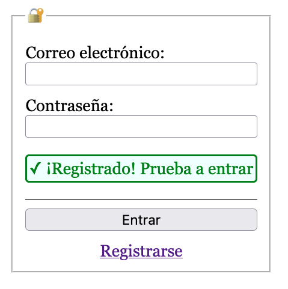

# HTML+CSS+JS
## Login

Sobre el proyecto descargado y abierto en el VSCode realiza las siguientes tareas para conseguir este resultado en la página de login:

| Error de credenciales | Login tras registro |
|-----------------------|---------------------|
|  |  |

> **📚 Tarea 1:** _Añade los campos **obligatorios** y del [tipo adecuado](https://developer.mozilla.org/en-US/docs/Web/HTML/Element/input#input_types) para el correo y la contraseña, y el [botón](https://developer.mozilla.org/en-US/docs/Web/HTML/Element/input/submit) para entrar._

> **📚 Tarea 2:** _Completa la funcionalidad de entrar [llamando](https://developer.mozilla.org/en-US/docs/Web/API/fetch#examples) al [API de login](intro.md) con los datos del formulario en formato JSON. En caso de éxito, [navega](https://developer.mozilla.org/en-US/docs/Web/API/Location/href) a la página `app.html`. En caso de fallo, muestra el aviso de "✖︎ Credenciales incorrectas"._

> **📚 Tarea 3:** _Añade los estilos CSS necesarios para mostrar los avisos según su tipo._

> 🔍 **Nota:** _Puedes utilizar las herramientas de desarrolladores del navegador para depurar el código, ver los mensajes JS por consola y ver las peticiones de red que realiza tu código._
> 

Ejemplo de uso...

> <object type="image/gif" data="./img/login.herramientas.gif" width="100%"></object>
> 
