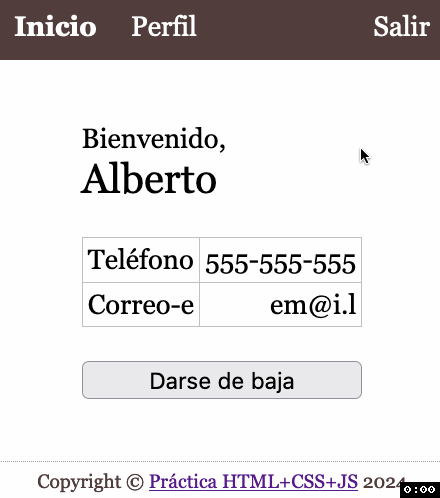

# HTML+CSS+JS
## Otros

Sobre el proyecto descargado y abierto en el VSCode realiza las siguientes tareas para conseguir este resultado:

| Darse de baja |
|---------------|
|  |

> **📚 Tarea 13:** _Añade el estilo necesario para que al pasar el [puntero por encima](https://developer.mozilla.org/en-US/docs/Web/CSS/:hover) de las secciones de arriba cambie su color de fondo._

> **📚 Tarea 14:** _Completa la funcionalidad de salir llamando al [API](intro.md) de borrar la sesión. En caso de éxito, navega a la página `login.html`._

> **📚 Tarea 15:** _Añade un [botón](https://www.w3schools.com/jsref/event_onclick.asp) para dar de baja al usuario._

> **📚 Tarea 16:** _Completa la funcionalidad de dar de baja llamando al [API](intro.md) de borrar la sesión. En caso de éxito, navega a la página `login.html`. Antes de proceder con la baja, [solicita confirmación](https://developer.mozilla.org/en-US/docs/Web/API/Window/confirm) al usuario._