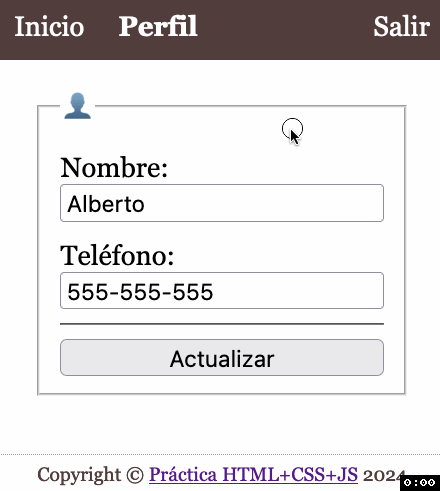

# HTML+CSS+JS
## Perfil

Sobre el proyecto descargado y abierto en el VSCode realiza las siguientes tareas para conseguir este resultado en la sección del perfil de la página principal:

| Actualizar perfil |
|-------------------|
|  |

> **📚 Tarea 11:** _Completa la función `articuloPerfil()` para que al ir a la sección estén rellenos los campos del formulario con la información recibida del perfil._

> **📚 Tarea 12:** _Completa la funcionalidad llamando al [API](intro.md) que actualiza los datos del perfil del usuario con los datos presentes en el formulario. En caso de éxito, [navega a la sección](https://www.w3schools.com/jsref/prop_loc_hash.asp) `#inicio`._