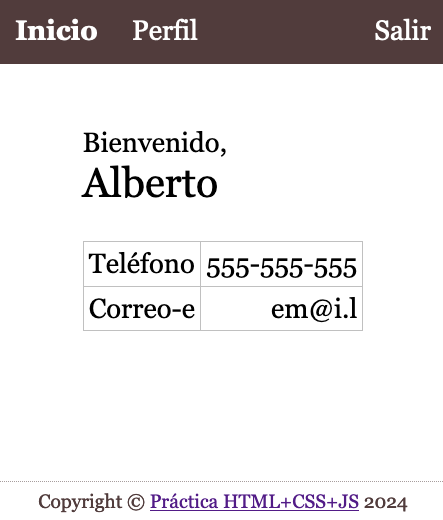

# HTML+CSS+JS
## Principal

Sobre el proyecto descargado y abierto en el VSCode realiza las siguientes tareas para conseguir este resultado en la página principal a la que se llega tras el login (**loguéate con tu usuario recién registrado**):

| Página principal aplicación |
|---------------------------|
|  |

> **📚 Tarea 7:** _Crea el pie de página "Copyright © Práctica HTML+CSS+JS 2024" añadiendo un enlace a esta misma página configurado para abrirse en una [pestaña/ventana nueva](https://developer.mozilla.org/en-US/docs/Web/HTML/Element/a#target). Añade las propiedades de estilo necesarias para que quede [fijado](https://developer.mozilla.org/en-US/docs/Web/CSS/position#fixed_positioning) en la parte inferior del navegador._

> **📚 Tarea 8:** _Implementa la función `datosPerfil()` para que llame al [API](intro.md) y retorne el JSON con los datos del perfil del usuario._

> **📚 Tarea 9:** _Añade la tabla con la información de contacto (de momento sin el valor del teléfono y correo-e rellenos)._

> **📚 Tarea 10:** _Completa la función `articuloInicio()` para que rellene los datos del nombre, teléfono y correo-e en el HTML con la información recibida del perfil._