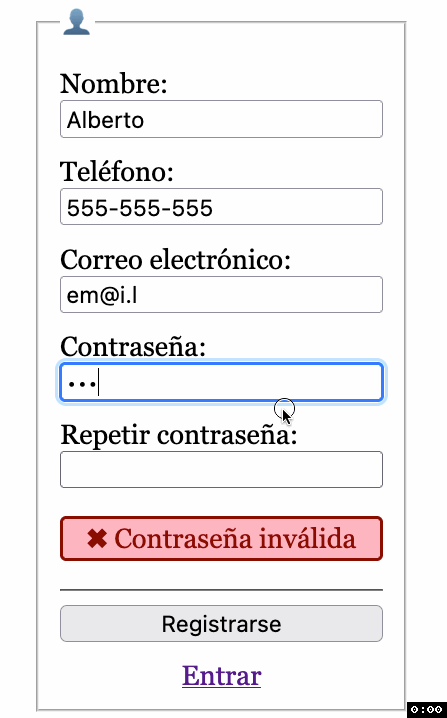
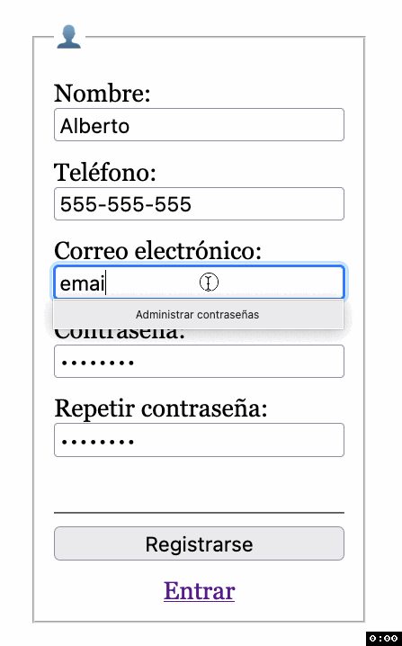

# HTML+CSS+JS
## Registro

Sobre el proyecto descargado y abierto en el VSCode realiza las siguientes tareas para conseguir este resultado en la página de registro:

| Contraseñas no coinciden | Usuario ya registrado |
|--------------------------|-----------------------|
|  |  |

> **📚 Tarea 4:** _Añade los campos que faltan al formulario de registro._

> **📚 Tarea 5:** _Valida que la contraseña tenga al menos 8 caracteres, que tenga al menos un número, una mayúscula y una minúscula con este [patrón](https://developer.mozilla.org/en-US/docs/Web/HTML/Attributes/pattern#specifying_a_pattern) `^(?=.*[0-9])(?=.*[A-Z])(?=.*[a-z]).*$`, y que ambas contraseñas coincidan mientras [se introducen](https://www.w3schools.com/jsref/event_onkeyup.asp). Utiliza el [DOM](https://developer.mozilla.org/en-US/docs/Web/API/Document/getElementById) para obtener el [valor](https://developer.mozilla.org/en-US/docs/Web/HTML/Element/input#value) de los campos en JS._

> **📚 Tarea 6:** _Completa la funcionalidad de registrarse llamando al [API de crear usuario](intro.md) con los datos del formulario en formato JSON. En caso de éxito, navega a la página `login.html?registrado`. En caso de fallo, muestra el aviso de "✖︎ Usuario ya registrado". Si hay errores en la contraseña, evita hacer la llamada._
